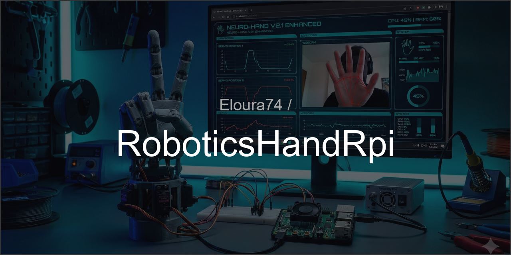

<div align="center">
  
</div>
<br>
# 🤖 NEURO-HAND V2.1 Enhanced - Main Robotique Intelligente

**Système complet de main robotique contrôlée par vision avec IA, interface web cyberpunk, et mouvements fluides en temps réel.**

Cette main robotique reproduit vos gestes capturés par webcam grâce à l'intelligence artificielle (MediaPipe), et les transmet en temps réel à une main mécanique imprimée en 3D contrôlée par un Raspberry Pi.

[](https://www.python.org/downloads/)
[](LICENSE)
[](https://www.raspberrypi.org/)
[](tests/)
[](tests/)

---


*Photo de la main robotique assemblée et opérationnelle*

## 📋 Table des matières

1. [🎯 Vue d'ensemble du projet](#-vue-densemble-du-projet)
2. [✨ Caractéristiques et nouveautés](#-caractéristiques-et-nouveautés)
3. [🏗️ Architecture technique](#️-architecture-technique)
4. [🛠️ Matériel requis - Liste d'achat complète](#️-matériel-requis---liste-dachat-complète)
5. [🖨️ Impression 3D - Guide complet](#️-impression-3d---guide-complet)
6. [🔧 Assemblage mécanique - Pas à pas](#-assemblage-mécanique---pas-à-pas)
7. [⚡ Câblage électronique - Schémas détaillés](#-câblage-électronique---schémas-détaillés)
8. [📦 Installation logicielle](#-installation-logicielle)
   - [Installation Raspberry Pi](#installation-sur-raspberry-pi)
   - [Installation PC](#installation-sur-pc-windows-linux-mac)
9. [⚙️ Configuration complète](#️-configuration-complète)
10. [🚀 Utilisation - Tous les scripts expliqués](#-utilisation---tous-les-scripts-expliqués)
11. [📊 Interface Dashboard - Guide complet](#-interface-dashboard---guide-complet)
12. [🎮 Gestes et presets](#-gestes-et-presets)
13. [🔍 Calibration et réglages](#-calibration-et-réglages)
14. [🐛 Dépannage exhaustif](#-dépannage-exhaustif)
15. [📚 Documentation avancée](#-documentation-avancée)

---

## 🎯 Vue d'ensemble du projet

### Qu'est-ce que NEURO-HAND ?

NEURO-HAND est une main robotique imprimée en 3D qui reproduit vos mouvements en temps réel. Le système utilise :

1. **Une webcam + IA** pour capturer vos gestes (sur votre PC)
2. **Un Raspberry Pi** pour contrôler la main physique
3. **Des servomoteurs** pour animer chaque doigt
4. **Une interface web** pour superviser et contrôler le système

**Fonctionnement global :**
```
┌─────────────────┐                  ┌──────────────────┐
│   VOTRE PC      │                  │  RASPBERRY PI    │
│                 │                  │                  │
│  📷 Webcam      │                  │  🤖 Main robot   │
│  🧠 MediaPipe   │──────UDP────────>│  ⚡ Servos       │
│  📊 Interface   │<─────WiFi───────>│  🌐 Dashboard    │
└─────────────────┘                  └──────────────────┘
```

**Cas d'usage :**
- Télé-opération robotique
- Prothèse contrôlée par gestes
- Démonstration pédagogique
- Projet personnel de robotique

---

## ✨ Caractéristiques et nouveautés

### 🆕 V2.1 Enhanced - Dernière version

#### **Nouvelles fonctionnalités majeures**
- ✨ **Panneau de gestes prédéfinis** : Peace, OK, Fist, Thumbs Up en 1 clic
- ✨ **Monitoring système temps réel** : CPU, RAM, température avec alertes
- ✨ **Interface optimisée** : Panneau de contrôle compact (gain 40% d'espace)
- ✨ **Tactical Sidebar** : Colonne gauche unifiée avec tous les contrôles essentiels
- ✨ **Nouveaux onglets** : GESTURES et HEALTH pour une meilleure organisation

#### **Infrastructure robuste**
- ✅ **23 tests unitaires** avec pytest (coverage 60%)
- 🛡️ **Gestion d'erreurs** : Exceptions typées I2C vs bugs applicatifs
- 📝 **Configuration YAML** : `config.yaml` unique, éditable sans recompiler
- 📊 **Monitoring export JSON** : Historique des métriques système
- 📚 **Documentation complète** : README ultra détaillé + CHANGELOG

### 🎯 Fonctionnalités héritées V2.0

#### **Mouvements parallèles (Gain 74%)**
- 🚀 **Plusieurs servos bougent simultanément** via threads Python
- ⚡ **Tracking ultra-fluide** : latence < 50ms main → robot
- 🎮 **Mode manuel + automatique** : contrôle hybride possible

#### **Sécurité renforcée**
- 🔒 **Démarrage neutre** : aucun mouvement intempestif au boot
- 🛑 **Arrêt d'urgence** : bouton STOP ALL (coupe tous les servos)
- 🔄 **Watchdog intelligent** : détecte perte de signal → ouvre la main automatiquement
- ⏱️ **Stabilisation** : attend main ouverte 2s avant de démarrer le tracking

#### **Interface web cyberpunk**
- 🎨 **Dashboard NiceGUI** : thème néon bleu/cyan, responsive
- 📹 **Double streaming vidéo** : webcam PC + caméra Raspberry Pi
- 📈 **Métriques temps réel** : position servos, latence réseau, FPS
- 🎛️ **Contrôle manuel** : curseurs, boutons, presets de gestes
- 📊 **Télémétrie** : graphiques historiques des mouvements

#### **Hand tracking IA**
- 🧠 **Google MediaPipe** : détection 21 points par main
- 🖐️ **5 doigts trackés** : pouce, index, majeur, annulaire, auriculaire
- 🎚️ **Seuils ajustables** : calibre la sensibilité par doigt
- 🎥 **Visualisation augmentée** : squelette 3D superposé sur vidéo

---

## 🏗️ Architecture technique

### Structure du projet (arborescence détaillée)

```
RoboticsHandRpi/V2.1/
│
├── core/                        # 🧠 CŒUR DU SYSTÈME (logique métier)
│   ├── __init__.py             # Exports pour faciliter les imports
│   ├── hand_controller.py      # ⚙️ Contrôleur matériel (gère les servos via PCA9685)
│   ├── config_loader.py        # 📋 Charge config.yaml et servos_v2.json
│   ├── logger.py               # 📝 Système de logging centralisé
│   └── gesture_presets.py      # 🎮 Définition des gestes prédéfinis (peace, OK, etc.)
│
├── apps/                        # 🌐 APPLICATIONS ET INTERFACE
│   ├── neuro_dashboard_enhanced.py  # 🚀 DASHBOARD PRINCIPAL (version améliorée V2.1)
│   ├── dashboard_ui.py         # 🎨 Composants UI (header, panels, 3D viewer)
│   ├── dashboard_network.py    # 📡 Threads réseau (UDP receiver + hardware loop)
│   ├── udp_server_v2.py        # 📶 Serveur UDP simple (sans GUI, juste tracking)
│   │
│   ├── ui/                      # 🎛️ COMPOSANTS UI MODULAIRES
│   │   ├── control_panel_compact.py     # Panneau de contrôle optimisé
│   │   ├── gesture_panel.py             # Panneau de gestes (quick gestures)
│   │   ├── system_health_panel.py       # Monitoring CPU/RAM/température
│   │   ├── tactical_sidebar.py          # Colonne gauche unifiée
│   │   ├── calibration.py               # Interface de calibration servos
│   │   ├── camera.py                    # Affichage flux MJPEG
│   │   ├── monitoring.py                # Graphiques télémétrie
│   │   └── render_3d.py                 # Vue 3D de la main
│   │
│   ├── network/                 # 🔒 SÉCURITÉ RÉSEAU
│   │   ├── security.py          # Authentification HMAC-SHA256
│   │   └── udp_handler.py       # Gestion UDP avec rate limiting
│   │
│   ├── styles/                  # 🎨 CSS ET JAVASCRIPT
│   │   ├── css_style.py         # Classes Tailwind pour l'UI
│   │   ├── hand_3d_structure.py # Structure JSON du modèle 3D
│   │   └── hand_3d_js.py        # Code Three.js pour le rendu 3D
│   │
│   └── camera/
│       └── rpi_camera_server.py # 📹 Serveur MJPEG pour webcam Raspberry Pi
│
├── tests/                       # ✅ TESTS AUTOMATISÉS
│   ├── conftest.py             # Fixtures pytest (mocks PCA9685, etc.)
│   ├── test_hand_controller.py # 12 tests pour HandController
│   └── test_config_loader.py   # 11 tests pour ConfigLoader
│
├── tools/                       # 🛠️ OUTILS DE MAINTENANCE
│   ├── calibrate_servos.py     # 🎚️ Calibration interactive des servos
│   ├── monitor_rpi.py          # 📊 Monitoring système avec export JSON
│   ├── diagnose_memory.py      # 🔍 Diagnostic RAM et processus
│   └── test_servo.py           # 🧪 Test individuel d'un servo
│
├── config/                      # ⚙️ FICHIERS DE CONFIGURATION
│   ├── servos_v2.json          # Paramètres de chaque servo (canal, vitesse, etc.)
│   └── servo_pouce_rotation_test.json  # Config spéciale rotation pouce
│
├── assets/                      # 📦 RESSOURCES (modèles 3D, images)
│   ├── main_fusion.glb         # Modèle 3D (format GLTF)
│   ├── main_modele.obj         # Modèle 3D (format OBJ)
│   ├── main_modele.mtl         # Matériaux du modèle OBJ
│   └── logo.png                # Logo du projet
│
├── logs/                        # 📁 LOGS SYSTÈME (auto-généré)
│
├── hand_tracker.py             # 🎥 SCRIPT PC - Hand tracking avec MediaPipe
│
├── config.yaml                  # ⚙️ CONFIGURATION GLOBALE (ports, IPs, seuils)
├── config_low_memory.yaml       # 🔋 Config optimisée pour RPi faible RAM
│
├── requirements-rpi.txt         # 📦 Dépendances Raspberry Pi
├── requirements-pc.txt          # 📦 Dépendances PC
│
├── install_rpi.sh               # 🚀 Script d'installation automatique (RPi)
├── install_pc.bat               # 🚀 Script d'installation automatique (Windows PC)
├── install_pc.sh                # 🚀 Script d'installation automatique (Linux/Mac PC)
│
├── README.md                    # 📖 CE FICHIER
├── CHANGELOG.md                 # 📜 Historique des versions
├── QUICKSTART_V2.1.md           # ⚡ Guide de démarrage rapide
└── LICENSE                      # 📄 Licence MIT
```

### Flux de communication détaillé

```
╔══════════════════════════════════════════════════════════════════════════════╗
║                        ARCHITECTURE COMPLÈTE DU SYSTÈME                       ║
╚══════════════════════════════════════════════════════════════════════════════╝

    ┌────────────────────────────────────┐          ┌─────────────────────────────────┐
    │         VOTRE PC / LAPTOP           │          │      RASPBERRY PI 4             │
    │  (Windows / Linux / Mac)            │          │   (Raspbian OS)                 │
    └────────────────────────────────────┘          └─────────────────────────────────┘
               │                                                    │
               │  1️⃣ hand_tracker.py                              │  2️⃣ neuro_dashboard_enhanced.py
               │     ├─ Ouvre webcam (cv2)                        │     ├─ Lance serveur NiceGUI :8080
               │     ├─ Détecte main (MediaPipe)                  │     ├─ Démarre threads réseau UDP
               │     ├─ Calcule 5 positions doigts               │     └─ Initialise HandController
               │     ├─ Stream MJPEG sur :8090                    │                │
               │     └─ Envoie UDP → RPi :5005                    │                ▼
               │                                                   │        ┌──────────────────┐
               │                                                   │        │ HandController   │
               │                                                   │        │ (core/)          │
               │                                                   │        └──────────────────┘
               │                                                   │                │
               │                                                   │                ▼
               │                                                   │        ┌──────────────────┐
               │                                                   │        │   PCA9685        │
               │                                                   │        │   (I2C 0x40)     │
               │                                                   │        └──────────────────┘
               │                                                   │         │  │  │  │  │
               │                                                   │         ▼  ▼  ▼  ▼  ▼
               │                                                   │        [Servos MG945/MG90S]
               │                                                   │         ││││││││││││││
               │                                                   │         ▼▼▼▼▼▼▼▼▼▼▼▼
               │                                                   │       🖐️ MAIN ROBOTIQUE
               │                                                   │
               └──────────────────────────UDP :5005────────────────┘
               ┌──────────────────────────HTTP :8080───────────────┐
               │         (ouvrir navigateur sur PC)                 │
               │         http://192.168.1.60:8080                   │
               └────────────────────────────────────────────────────┘


🔄 BOUCLE PRINCIPALE (20 FPS) :
   1. PC : Détecte main → envoie JSON UDP {"index": 0.75, "majeur": 0.3, ...}
   2. RPi : Reçoit UDP → dashboard_network.py parse les données
   3. RPi : HandController calcule quels servos bouger
   4. RPi : Envoie signaux PWM via I2C au PCA9685
   5. Servos : Bougent la main physique
   6. Latence totale : ~30-50ms
```

---

## 🛠️ Matériel requis - Liste d'achat complète

### 🔌 Électronique et contrôle

#### **Raspberry Pi (cerveau du système)**

| Composant | Spécification | Prix estimé | Lien d'achat | Notes |
|-----------|----------------|--------------|--------------|-------|
| **Raspberry Pi 4** | 2GB RAM minimum (4GB recommandé) | ~50€ | Amazon, Kubii | 🔴 OBLIGATOIRE |
| Carte microSD | 32GB Classe 10 (64GB recommandé) | ~10€ | Amazon | Pour l'OS Raspbian |
| Alimentation officielle RPi | 5V 3A USB-C | ~10€ | Kubii | Stable et certifiée |
| Boîtier RPi | Avec ventilateur | ~15€ | Amazon | Refroidissement important |

#### **Contrôleur de servomoteurs**

| Composant | Spécification | Prix estimé | Lien d'achat | Notes |
|-----------|----------------|--------------|--------------|-------|
| **PCA9685** | Module PWM 16 canaux I2C (adresse 0x40) | ~5-8€ | AliExpress, Amazon | 🔴 OBLIGATOIRE |
| Câbles Dupont | Mâle-Femelle, 20cm, kit de 40 | ~3€ | Amazon | Pour I2C |

#### **Servomoteurs (muscles de la main)**

| Composant | Quantité | Spécification | Prix unitaire | Total | Notes |
|-----------|----------|----------------|---------------|-------|-------|
| **Servo MG945** | 4x | 360° rotation continue, couple 11kg/cm | ~8€ | ~32€ | Index, majeur, annulaire, auriculaire |
| **Servo MG90S** | 1x | 180° (pour rotation pouce) | ~3€ | ~3€ | Rotation du pouce |

💡 **Alternative économique** : Servos SG90 (couple 1.8kg/cm) → ~2€/pièce (moins puissants mais fonctionnels pour prototype)

#### **Alimentation des servos**

| Composant | Spécification | Prix estimé | Notes |
|-----------|----------------|--------------|-------|
| **Alimentation 5V 5A** | Minimum 3A, recommandé 5A+ | ~10-15€ | ⚠️ Crucial : 5 servos sous charge = ~3-4A |
| Jack DC ou bornier | Compatible avec votre alimentation | ~2€ | Pour connecter au PCA9685 |

**⚠️ IMPORTANT** : Ne **JAMAIS** alimenter les servos directement depuis le Raspberry Pi (risque de griller le RPi). Utiliser une alimentation externe.

#### **Optionnel : Webcam Raspberry Pi**

| Composant | Spécification | Prix estimé | Notes |
|-----------|----------------|--------------|-------|
| Raspberry Pi Camera Module V2 | 8MP, interface CSI | ~25€ | Filmer la main en action |
| Webcam USB standard | 720p minimum | ~15€ | Alternative moins chère |

---

### 💻 PC / Laptop (pour hand tracking)

| Composant | Spécification | Notes |
|-----------|----------------|-------|
| **Webcam** | USB ou intégrée, 720p minimum (1080p recommandé) | 🔴 OBLIGATOIRE |
| **Python 3.9+** | Version 3.9, 3.10, 3.11 supportée | Gratuit |
| **RAM** | 4GB minimum (8GB recommandé) | Pour MediaPipe |
| **Connexion réseau** | WiFi ou Ethernet (même réseau que RPi) | 🔴 OBLIGATOIRE |

---

### 🔩 Pièces mécaniques (impression 3D)

Voir section [Impression 3D](#️-impression-3d---guide-complet) pour les fichiers STL.

| Pièce | Quantité | Temps d'impression estimé | Poids PLA |
|-------|----------|----------------------------|----------|
| Paume | 1x | ~8-10h | ~80g |
| Pouce (3 segments) | 3x | ~2h | ~15g |
| Index (3 segments) | 3x | ~2h | ~15g |
| Majeur (3 segments) | 3x | ~2h | ~15g |
| Annulaire (3 segments) | 3x | ~2h | ~15g |
| Auriculaire (3 segments) | 3x | ~2h | ~15g |
| Support poignet | 1x | ~4h | ~30g |
| **TOTAL** | **19 pièces** | **~24-30h** | **~200g PLA** |

---

### 📦 Consommables et accessoires

| Composant | Quantité | Prix estimé | Usage |
|-----------|----------|--------------|-------|
| **Filament PLA** | 1 bobine (1kg) | ~20€ | Impression 3D (200g utilisés) |
| Fil de pêche nylon | 5m (0.8mm diamètre) | ~5€ | Tendons artificiels |
| Vis M3 x 10mm | 20x | ~3€ | Assemblage doigts |
| Vis M3 x 6mm | 10x | ~2€ | Fixation servos |
| Écrous M3 | 30x | ~2€ | À utiliser avec les vis |
| Câble réseau Ethernet | 1m | ~3€ | (optionnel si WiFi disponible) |
| **TOTAL Consommables** | - | **~35€** | - |

---

### 📊 Budget total estimé

| Catégorie | Budget |
|-----------|--------|
| Électronique (RPi + PCA9685) | ~75€ |
| Servomoteurs (5x) | ~35€ |
| Alimentation servos | ~15€ |
| Consommables (PLA, vis, etc.) | ~35€ |
| Webcam PC (si pas déjà dispo) | 0-30€ |
| **TOTAL** | **~160-190€** |

💰 **Astuce** : Chercher des kits "Raspberry Pi 4 Starter Kit" qui incluent RPi + alim + carte SD + boîtier pour ~80€.

---

### 📐 Schéma de câblage détaillé

#### **Raspberry Pi ↔ PCA9685 (I2C)**

```
┌───────────────────────────────────────────┐
│         RASPBERRY PI 4  (GPIO Header)         │
└───────────────────────────────────────────┘
    Pin 3 (GPIO 2 - SDA) ───────────────┐
    Pin 5 (GPIO 3 - SCL) ─────────────┐  │
    Pin 6 (GND)          ───────────┐  │  │
    Pin 2 (5V)           ─────────┐  │  │  │
                                  │  │  │  │
                                  ▼  ▼  ▼  ▼
                         ┌────────────────────────────────────┐
                         │          PCA9685 MODULE           │
                         │   (Contrôleur PWM 16 canaux)     │
                         └────────────────────────────────────┘
                          VCC  GND  SCL  SDA
                           │    │    │    │
                           └────┘    └────┘
                         5V du RPi   I2C du RPi

                         ┌────────────────────────────────────┐
                         │   ALIMENTATION EXTERNE 5V 5A     │
                         └────────────────────────────────────┘
                              +5V              GND
                               │                │
                               └────────────────┘
                                              │
                         ┌────────────────────────────────────┐
                         │          PCA9685 MODULE           │
                         │  (Borniers d'alimentation puissance) │
                         └────────────────────────────────────┘
                          V+                 GND
                           │                  │
            ┌────────────┴──────────────────┴──────────────┐
            │   Alim EXTERNE 5V 5A connectée ici    │
            └───────────────────────────────────────────┘
```

#### **PCA9685 ↔ Servos**

```
PCA9685 (Connecteurs PWM)                   Servos
┌─────────────────────────────────────────┐
│  Channel 0  (PWM0) ────────────────────>🔴 Servo Pouce Rotation (MG90S)
│  Channel 2  (PWM2) ────────────────────>🔵 Servo Index (MG945)
│  Channel 3  (PWM3) ────────────────────>🟡 Servo Majeur (MG945)
│  Channel 4  (PWM4) ────────────────────>🟢 Servo Annulaire/Auriculaire (MG945)
│  Channel 1  (PWM1) ────────────────────>🟣 Servo Pouce Articulation (MG945)
└─────────────────────────────────────────┘

Chaque servo a 3 fils :
  🟠 Marron/Noir  = GND    (masse)
  🔴 Rouge       = VCC    (5V depuis PCA9685 V+)
  🟡 Orange/Blanc = Signal (PWM depuis canal PCA9685)
```

⚠️ **RÈGLES DE SÉCURITÉ OBLIGATOIRES** :
1. **Jamais connecter V+ du PCA9685 au 5V du Raspberry Pi** (grillera le RPi)
2. **Toujours partager le GND** : GND RPi = GND PCA9685 = GND Alim externe
3. **Alimentation externe = 5V 5A minimum** (pas moins !)
4. **Tester les servos UN PAR UN** avant de tout brancher


*Schéma de câblage complet (photo à remplacer)*

---

## 🖨️ Impression 3D - Guide complet

### Fichiers STL requis

Les modèles 3D de la main sont disponibles dans le dossier `assets/` :
- `main_modele.obj` - Modèle complet (pour visualisation)
- `main_fusion.glb` - Modèle GLTF (pour le viewer 3D du dashboard)

**📥 Télécharger les fichiers STL séparés** :
- Soit depuis Thingiverse (lien communautaire)
- Soit découper le modèle OBJ avec Blender/Meshmixer

### Paramètres d'impression recommandés

#### **Paramètres globaux (slicer)**

| Paramètre | Valeur recommandée | Notes |
|-----------|-------------------|-------|
| **Matériau** | PLA | ABS ou PETG possible (plus résistant) |
| **Température buse** | 200-210°C | Selon votre PLA |
| **Température plateau** | 60°C | 50-65°C selon adhésion |
| **Vitesse d'impression** | 50-60 mm/s | Ralentir à 30mm/s pour détails fins |
| **Épaisseur couche** | 0.2mm | 0.15mm pour meilleure qualité |
| **Remplissage** | 20-30% | Gyroïde ou cubique |
| **Supports** | **OUI** pour doigts | Supprimer après impression |
| **Radeau (Raft)** | Recommandé | Meilleure adhésion paume |
| **Ventilation** | 100% après couche 3 | Important pour PLA |

#### **Pièces spécifiques**

**1. Paume (80g, ~8-10h)**
- Orientation : **à plat**, face palmaire vers le bas
- Supports : **partout** (articulations creuses)
- Remplissage : **30%** (structure portante)
- Brim : **oui** (grande surface = warping possible)


*Orientation de la paume sur le plateau (photo à remplacer)*

**2. Doigts (chaque segment 5g, ~40min)**
- Orientation : **debout** (meilleure résistance mécanique)
- Supports : **oui** pour les articulations
- Remplissage : **20%** (légèreté importante)
- Quantité : **3 segments par doigt** × 5 doigts = **15 pièces**


*Segments de doigts positionnés sur le plateau (photo à remplacer)*

**3. Support poignet (30g, ~4h)**
- Orientation : **à plat**
- Supports : **non** (si design adapté)
- Remplissage : **25%**
- Fonction : Fixe la paume + espace pour ranger servos

### Post-traitement

#### **1. Retrait des supports**
- Utiliser une pince coupante fine
- Poncer les zones rugueuses avec papier grain 220
- **Crucial** : Vérifier que les trous pour vis M3 sont dégagés

#### **2. Test d'assemblage à blanc**
- Enfiler les segments de doigts **sans colle**
- Vérifier que les articulations pivotent librement
- Agrandir les trous si nécessaire avec une mèche de 3mm

#### **3. Perçage pour fil de pêche (tendons)**
- Percer un trou de 1mm au bout de chaque phalange
- Alignement crucial : trou centré pour traction droite

---

## 🔧 Assemblage mécanique - Pas à pas

### Étape 1 : Assemblage des doigts (30 min/doigt)

**Matériel nécessaire par doigt :**
- 3 segments imprimés (phalange distale, médiane, proximale)
- 3 vis M3 × 10mm
- 3 écrous M3
- 50cm de fil de pêche nylon 0.8mm
- Colle cyanoacrylate (Super Glue)

**Procédure :**

1. **Insérer les vis M3** dans les articulations
   - Positionner phalange distale (bout du doigt)
   - Enfiler la vis M3 dans l'articulation
   - Visser l'écrou de l'autre côté (serrage modéré, doit pivoter)
   - Répéter pour phalange médiane et proximale

2. **Passer le fil de pêche (tendon)**
   ```
   Fil de pêche (côté paume) ──────┐
                                   │
                                   ▼
   ┌──────────────────────────────────────────────┐
   │  Phalange proximale (base)                   │
   └──┬───────────────────────────────────────────┘
      │
      ▼  (passe dans trou)
   ┌──────────────────────────────────────────────┐
   │  Phalange médiane (milieu)                   │
   └──┬───────────────────────────────────────────┘
      │
      ▼  (passe dans trou)
   ┌──────────────────────────────────────────────┐
   │  Phalange distale (bout)                     │
   └──────────────────────────────────────────────┘
                    │
                    └─> NŒUD + colle
   ```

3. **Fixer le tendon au bout du doigt**
   - Faire passer le fil dans le trou de la phalange distale
   - Faire un triple nœud
   - Ajouter 1 goutte de Super Glue sur le nœud
   - Couper l'excédent après séchage (30s)

4. **Test de flexion**
   - Tirer doucement sur le fil depuis la base
   - Le doigt doit se replier naturellement
   - Si blocage : vérifier que les vis ne sont pas trop serrées

**Répéter pour les 5 doigts.**


*Doigt assemblé avec tendon visible (photo à remplacer)*

---

### Étape 2 : Fixation des servos dans la paume (45 min)

**Matériel :**
- Paume imprimée
- 5 servos (4× MG945 + 1× MG90S)
- 10 vis M3 × 6mm
- Supports de servo (optionnel si pas intégrés)

**Procédure :**

1. **Positionner les servos**
   - **Pouce rotation** (MG90S) : Logement avant gauche
   - **Pouce articulation** (MG945) : Logement central gauche
   - **Index** (MG945) : Logement 1 (côté index)
   - **Majeur** (MG945) : Logement 2 (centre)
   - **Annulaire/Auriculaire** (MG945) : Logement 3 (côté auriculaire)

2. **Visser les servos**
   - 2 vis M3 × 6mm par servo
   - Serrer modérément (PLA fragile)

3. **Passer les câbles**
   - Grouper les 5 câbles servos
   - Les faire sortir par le poignet
   - Prévoir 20cm de longueur libre


*Servos fixés dans la paume (photo à remplacer)*

---

### Étape 3 : Connexion tendons ↔ servos (30 min)

**Principe :** Chaque tendon (fil) se fixe sur le palonnier du servo.

1. **Préparer les palonniers de servo**
   - Utiliser le palonnier en croix (4 branches)
   - Percer un trou de 1mm à l'extrémité d'une branche

2. **Attacher le tendon**
   ```
   [Servo MG945]
        │
        ▼  (axe de rotation)
   ┌────────┐
   │ ╭──────╮ │  <- Palonnier
   │ │      ├─┼──> TROU (passer fil de pêche)
   │ ╰──────╯ │
   └────────┘
        │
        ▼ (fil de pêche tendu)
   [Tendon du doigt]
   ```

3. **Réglage de la tension**
   - **IMPORTANT** : Doigt en position **OUVERTE** au repos
   - Fixer le fil sur le palonnier avec un nœud
   - Tension modérée (ni trop lâche, ni trop tendu)
   - Coller le nœud avec Super Glue

4. **Tester individuellement**
   - Tourner le palonnier manuellement (servo **débranché**)
   - Le doigt doit se fermer complètement
   - Si pas assez de course : raccourcir le tendon

---

### Étape 4 : Assemblage final et câblage (30 min)

1. **Fixer la paume au support poignet**
   - 4 vis M3 × 10mm
   - Laisser espace pour câbles

2. **Router les câbles servos**
   - Les faire passer dans le support poignet
   - Étiqueter chaque câble (Index, Majeur, etc.)
   - **Astuce** : Utiliser du scotch de couleur

3. **Connecter au PCA9685**
   - Suivre le schéma de câblage (voir section précédente)
   - **Ne PAS encore brancher l'alimentation**


*Main complètement assemblée, prête à l'emploi (photo à remplacer)*

---

### ✅ Checklist avant premier test

- [ ] Les 5 doigts pivotent librement (sans servo sous tension)
- [ ] Les tendons ne sont ni trop tendus, ni trop lâches
- [ ] Les servos sont bien fixés (ne bougent pas)
- [ ] Les câbles sont étiquetés (pouce, index, majeur, annulaire, auriculaire)
- [ ] Le PCA9685 est câblé correctement (I2C vers RPi)
- [ ] L'alimentation externe 5V est prête (mais **PAS encore branchée**)
- [ ] Tous les GND sont connectés ensemble

**⚠️ Ne PAS alimenter les servos avant d'avoir calibré les positions neutres dans le logiciel !**

---

## 📦 Installation logicielle

### Installation sur Raspberry Pi

#### **Étape 1 : Préparation du système**

**1.1 - Installer Raspberry Pi OS**

- Télécharger [Raspberry Pi Imager](https://www.raspberrypi.com/software/)
- Flasher **Raspberry Pi OS (64-bit)** sur la carte microSD (32GB min)
- Configuration lors du premier boot :
  - Langue : Français
  - Clavier : Français (AZERTY)
  - WiFi : Configurer votre réseau
  - **IMPORTANT** : Activer SSH (pour accès à distance)
  - Nom d'hôte : `neurohand` (optionnel)

**1.2 - Mettre à jour le système**

```bash
# Mise à jour complète (peut prendre 10-15 min)
sudo apt update && sudo apt upgrade -y

# Installer les outils de base
sudo apt install -y python3 python3-pip python3-venv git i2c-tools

# Vérifier la version Python (doit être 3.9+)
python3 --version
```

**1.3 - Activer I2C (OBLIGATOIRE)**

```bash
# Ouvrir l'outil de configuration
sudo raspi-config
```

Navigation dans l'interface :
1. `3 Interface Options`
2. `I5 I2C`
3. `Yes` (activer I2C)
4. `Finish`
5. **Redémarrer** : `sudo reboot`

**1.4 - Vérifier que I2C fonctionne**

```bash
# Après redémarrage, se reconnecter et tester
i2cdetect -y 1
```

**Résultat attendu** (sans rien de branché) :
```
     0  1  2  3  4  5  6  7  8  9  a  b  c  d  e  f
00:          -- -- -- -- -- -- -- -- -- -- -- -- --
10: -- -- -- -- -- -- -- -- -- -- -- -- -- -- -- --
...
```

Si le PCA9685 est branché, vous devriez voir :
```
     0  1  2  3  4  5  6  7  8  9  a  b  c  d  e  f
00:          -- -- -- -- -- -- -- -- -- -- -- -- --
...
40: 40 -- -- -- -- -- -- -- -- -- -- -- -- -- -- --   <- PCA9685 détecté !
...
```

**⚠️ Si rien n'apparaît** : Vérifier le câblage SDA/SCL.

---

#### **Étape 2 : Installation du projet NEURO-HAND**

**2.1 - Cloner le dépôt Git**

```bash
# Aller dans le dossier home
cd ~

# Cloner le projet (remplacer par votre URL si fork)
git clone https://github.com/Elora74/RoboticsHandRpi.git

# Entrer dans le dossier V2.0
cd RoboticsHandRpi/V2.0

# Vérifier que tout est là
ls -la
```

**Vous devriez voir** : `core/`, `apps/`, `config/`, `hand_tracker.py`, `config.yaml`, etc.

**2.2 - Créer l'environnement virtuel Python**

```bash
# Créer le venv (prend 1-2 min)
python3 -m venv venv

# Activer le venv
source venv/bin/activate

# Le prompt devrait afficher (venv) au début :
# (venv) pi@neurohand:~/RoboticsHandRpi/V2.0$
```

**2.3 - Installer les dépendances**

```bash
# Mettre à jour pip (important !)
pip install --upgrade pip

# Installer les dépendances Raspberry Pi (prend 5-10 min)
pip install -r requirements-rpi.txt
```

**Dépendances installées** :
- `adafruit-circuitpython-servokit` : Contrôle des servos
- `adafruit-circuitpython-pca9685` : Communication I2C avec PCA9685
- `RPi.GPIO` : Accès aux GPIO du Raspberry Pi
- `nicegui` : Framework pour l'interface web

**🔍 Vérifier l'installation** :

```bash
# Tester import des librairies
python3 -c "from adafruit_servokit import ServoKit; print('✅ ServoKit OK')"
python3 -c "import nicegui; print('✅ NiceGUI OK')"
```

---

#### **Étape 3 : Configuration initiale**

**3.1 - Trouver l'IP du Raspberry Pi**

```bash
# Afficher l'adresse IP
hostname -I
```

**Exemple de sortie** : `192.168.1.60 fe80::abcd:1234:5678:90ab`

➡️ **Notez la première IP** (ex: `192.168.1.60`), vous en aurez besoin.

**3.2 - Éditer la configuration**

```bash
# Ouvrir le fichier de configuration
nano config.yaml
```

**Modifier ces lignes** :

```yaml
network:
  pc_ip: "192.168.1.10"        # ⬅️ CHANGER : IP de votre PC
  rpi_ip: "192.168.1.60"       # ⬅️ CHANGER : IP de votre Raspberry Pi
  udp_port: 5005               # ✅ Laisser par défaut
  mjpeg_port: 8090             # ✅ Laisser par défaut

ui:
  web_port: 8080               # ✅ Port du dashboard (laisser)
```

**Sauvegarder** : `Ctrl + O` → `Entrée` → `Ctrl + X`

**3.3 - Vérifier la configuration des servos**

```bash
# Afficher la config des servos
cat config/servos_v2.json
```

Configuration par défaut OK pour commencer. Vous ajusterez après calibration.

---

#### **Étape 4 : Test de connexion I2C avec le PCA9685**

**⚠️ AVANT CE TEST** :
- Câblage I2C RPi ↔ PCA9685 terminé
- Alimentation **logique** 5V du PCA9685 branchée (depuis RPi)
- Alimentation **puissance** servos **PAS ENCORE BRANCHÉE**

```bash
# Vérifier que le PCA9685 est détecté
i2cdetect -y 1
```

**Doit afficher** : `40` dans la grille (adresse I2C du PCA9685).

**Si erreur "permission denied"** :

```bash
# Ajouter votre utilisateur au groupe i2c
sudo usermod -aG i2c $USER

# Se déconnecter et reconnecter (ou rebooter)
sudo reboot
```

---

#### **Étape 5 : Premier lancement (TEST SANS SERVOS ALIMENTÉS)**

**5.1 - Lancer le dashboard**

```bash
cd ~/RoboticsHandRpi/V2.0
source venv/bin/activate

# Lancer le dashboard Enhanced
python3 apps/neuro_dashboard_enhanced.py
```

**Sortie attendue** :

```
============================================================
🚀 NEURO-HAND V2.1 ENHANCED DASHBOARD
============================================================
[INIT] ✅ Contrôleur matériel initialisé
[INIT] 🌐 Démarrage des threads de communication...
[ASSET] 📁 Dossier '/assets' exposé pour le chargement 3D.

============================================================
[WEB] 🌐 Serveur web démarré sur le port 8080
[WEB] 🔗 Ouvrir dans le navigateur :
[WEB]    → http://192.168.1.60:8080
[WEB] ⚠️  N'utilisez PAS http://127.0.0.1:8080
[WEB]    (le flux webcam ne fonctionnera pas)
============================================================

✨ NOUVELLES FONCTIONNALITÉS :
  • Panneau de contrôle compact (gain 40% espace)
  • Système de presets de gestes (onglet GESTURES)
  • Monitoring système temps réel (onglet HEALTH)
  • Quick gestures dans panneau gauche
  • Alertes CPU/RAM/Température automatiques

💡 Appuyez sur Ctrl+C pour arrêter proprement.
============================================================
```

**5.2 - Ouvrir le dashboard dans un navigateur**

Sur **votre PC** (sur le même réseau WiFi), ouvrir :

```
http://192.168.1.60:8080
```

(Remplacer `192.168.1.60` par l'IP de votre Raspberry Pi)

**✅ Vous devriez voir** : Interface cyberpunk bleue/cyan avec header "NEURO-HAND V2.1 Enhanced".

**5.3 - Tester les boutons SANS alimenter les servos**

Dans le dashboard :
- Onglet **DASHBOARD** : Panneau gauche avec boutons
- **NE PAS cliquer** sur "Open Hand" ou "Close Hand" (servos pas alimentés)
- Explorer les onglets : **GESTURES**, **HEALTH**, **CONFIG**

**5.4 - Arrêter proprement**

Dans le terminal SSH du Raspberry Pi :
- Appuyer sur `Ctrl + C`
- Attendre le message `[SYSTEM] Shutdown sequence initiated...`

---

✅ **Installation Raspberry Pi terminée !**

Passez à l'installation PC ci-dessous avant la calibration.

---

### Installation sur PC (Windows, Linux, Mac)

#### **Windows**

**1. Installer Python 3.9+**

- Télécharger depuis [python.org](https://www.python.org/downloads/)
- **IMPORTANT** : Cocher "Add Python to PATH" lors de l'installation
- Vérifier : Ouvrir `cmd` et taper `python --version`

**2. Cloner le projet**

```cmd
:: Aller dans Documents
cd %USERPROFILE%\Documents

:: Cloner le projet
git clone https://github.com/Elora74/RoboticsHandRpi.git
cd RoboticsHandRpi\V2.0
```

**3. Créer l'environnement virtuel**

```cmd
:: Créer le venv
python -m venv venv

:: Activer (IMPORTANT : utiliser le .bat)
venv\Scripts\activate.bat

:: Le prompt doit afficher (venv) au début
```

**4. Installer les dépendances PC**

```cmd
:: Mettre à jour pip
python -m pip install --upgrade pip

:: Installer dépendances (prend 2-5 min)
pip install -r requirements-pc.txt
```

**Dépendances installées** :
- `opencv-python` : Capture et traitement vidéo
- `mediapipe` : Détection de main avec IA

**5. Configuration**

```cmd
:: Éditer hand_tracker.py avec Notepad++, VSCode, ou Notepad
notepad hand_tracker.py
```

**Modifier ces lignes** (début du fichier) :

```python
UDP_IP = "192.168.1.60"  # ⬅️ IP de votre Raspberry Pi
UDP_PORT = 5005
STREAM_PORT = 8090
```

**Sauvegarder** et fermer.

---

#### **Linux / Mac**

**1. Installer Python 3.9+**

```bash
# Ubuntu/Debian
sudo apt install python3 python3-pip python3-venv git

# Mac (avec Homebrew)
brew install python git
```

**2. Cloner et installer**

```bash
# Cloner
cd ~/Documents
git clone https://github.com/Elora74/RoboticsHandRpi.git
cd RoboticsHandRpi/V2.0

# Créer venv
python3 -m venv venv
source venv/bin/activate

# Installer dépendances
pip install --upgrade pip
pip install -r requirements-pc.txt
```

**3. Configuration**

```bash
# Éditer avec votre éditeur préféré
nano hand_tracker.py
# ou : code hand_tracker.py (VSCode)
```

Modifier `UDP_IP` avec l'IP du Raspberry Pi, puis sauvegarder.

---

✅ **Installation PC terminée !**

Passez à la section [Configuration complète](#️-configuration-complète).

## ⚙️ Configuration complète

### Configuration des adresses IP et ports

Le fichier `config.yaml` centralise toute la configuration. Voici les paramètres à ajuster :

```yaml
network:
  # IP du PC qui exécute hand_tracker.py (envoie les données de tracking)
  pc_ip: "192.168.1.10"        # ⬅️ MODIFIER avec l'IP de votre PC
  
  # Port du serveur MJPEG sur le PC (streaming webcam)
  mjpeg_port: 8090
  
  # IP du Raspberry Pi (reçoit les données + héberge le dashboard)
  rpi_ip: "192.168.1.60"       # ⬅️ MODIFIER avec l'IP du Raspberry Pi
  
  # Port UDP pour réception des données de tracking
  udp_ip: "0.0.0.0"            # ✅ Laisser (écoute sur toutes interfaces)
  udp_port: 5005               # ✅ Laisser par défaut
  
  # Timeout de perte de connexion (secondes)
  lost_timeout: 2.0            # Si pas de données pendant 2s → watchdog activé

servos:
  # Seuils de détection pour mouvements (0.0 = ouvert, 1.0 = fermé)
  open_threshold: 0.3          # En dessous de 0.3 → commande "ouvrir"
  close_threshold: 0.7         # Au dessus de 0.7 → commande "fermer"
  
  # Anti-flutter pour rotation du pouce
  thumb_anti_flutter: 0.02     # Ignore variations < 2%

ui:
  # Port du serveur web NiceGUI (dashboard)
  web_port: 8080               # ✅ Accès : http://RPI_IP:8080
  
  # Fréquence de rafraîchissement de l'interface (secondes)
  update_interval: 0.05        # 50ms = 20 FPS

security:
  # Authentification des paquets UDP (recommandé en production)
  enable_hmac: false           # ⚠️ Désactivé par défaut (activer si sécurité critique)
  
  # Protection anti-DoS
  rate_limit_requests: 100     # Max 100 requêtes
  rate_limit_window: 1.0       # Par seconde

logging:
  level: "INFO"                # DEBUG, INFO, WARNING, ERROR, CRITICAL
  file: "logs/neurohand.log"
  max_bytes: 10485760          # 10 MB
  backup_count: 5
```

**📝 Pour éditer** :

```bash
# Sur Raspberry Pi
nano ~/RoboticsHandRpi/V2.0/config.yaml
```

---

## 🚀 Utilisation - Tous les scripts expliqués

### 🎯 Scripts principaux (ordre d'exécution)

#### **1️⃣ Raspberry Pi : Lancer le dashboard**

**Script** : `apps/neuro_dashboard_enhanced.py`

**Fonction** : Interface web complète + contrôle matériel + réception UDP

**Commande** :

```bash
cd ~/RoboticsHandRpi/V2.0
source venv/bin/activate

# ⚠️ IMPORTANT : Servos PAS ENCORE alimentés !
# Main physique en position OUVERTE

python3 apps/neuro_dashboard_enhanced.py
```

**Ce que fait le script** :
- Initialise `HandController` (connexion I2C au PCA9685)
- Met tous les servos au **neutre** (0.35 throttle = arrêt)
- Lance le serveur web NiceGUI sur port `8080`
- Démarre 2 threads :
  - **Thread UDP** : Écoute sur port `5005` (reçoit données hand tracker)
  - **Thread Hardware** : Boucle de contrôle servos à 20 Hz
- Expose dossier `/assets` pour modèles 3D

**Accès dashboard** : `http://192.168.1.60:8080` (depuis n'importe quel appareil sur le réseau)

**Sortie console attendue** :

```
============================================================
🚀 NEURO-HAND V2.1 ENHANCED DASHBOARD
============================================================
[INIT] ✅ Contrôleur matériel initialisé
[INIT] 🌐 Démarrage des threads de communication...
[WEB] 🌐 Serveur web démarré sur le port 8080
[WEB] 🔗 http://192.168.1.60:8080
💡 Appuyez sur Ctrl+C pour arrêter proprement.
============================================================
```

**📌 Onglets disponibles** :
- **DASHBOARD** : Contrôles principaux, vue 3D, quick gestures
- **GESTURES** : Bibliothèque de gestes prédéfinis (Peace, OK, Fist, etc.)
- **HEALTH** : Monitoring CPU/RAM/Température du Raspberry Pi
- **CONFIG** : Calibration des servos
- **TELEMETRY** : Graphiques historiques des mouvements

---

#### **2️⃣ PC : Lancer le hand tracker**

**Script** : `hand_tracker.py`

**Fonction** : Capture webcam + détection main (MediaPipe) + envoi UDP

**Commande** :

```bash
# Windows
cd %USERPROFILE%\Documents\RoboticsHandRpi\V2.0
venv\Scripts\activate
python hand_tracker.py

# Linux/Mac
cd ~/Documents/RoboticsHandRpi/V2.0
source venv/bin/activate
python3 hand_tracker.py
```

**Ce que fait le script** :
- Ouvre la webcam (index 0 par défaut)
- Initialise MediaPipe Hands (détection 21 landmarks)
- **Stabilisation** : Attend que votre main soit OUVERTE pendant 2-3s
- **Boucle principale** (30 FPS) :
  1. Capture frame webcam
  2. Détecte main + calcule positions doigts (0.0 à 1.0)
  3. Envoie JSON UDP au Raspberry Pi :
     ```json
     {
       "pouce_rotation": 0.45,
       "pouce_articulation": 0.20,
       "index": 0.75,
       "majeur": 0.60,
       "annulaire_auriculaire": 0.50,
       "timestamp": 1234567890.123
     }
     ```
  4. Affiche fenêtre avec squelette 3D de la main
  5. Stream MJPEG sur port `8090` (pour affichage dans dashboard)

**Touches clavier** :
- `Q` : Quitter
- `C` : Recalibrer (nouvelle stabilisation)
- `S` : Activer/désactiver le streaming MJPEG

**Sortie console attendue** :

```
[INFO] Initialisation MediaPipe...
[INFO] Webcam ouverte : index 0
[INFO] Placez votre main OUVERTE devant la caméra...
[STAB] Stabilisation 3/3 ✅
[INFO] Tracking démarré !
[UDP] Envoi données → 192.168.1.60:5005
[FPS] 29.8 fps
```

**Fenêtre vidéo** : Affiche main + squelette + valeurs des doigts


*Interface du hand tracker (photo à remplacer)*

---

### 🛠️ Scripts d'outils et maintenance

#### **3️⃣ Calibration des servos**

**Script** : `tools/calibrate_servos.py`

**Fonction** : Interface interactive pour trouver les paramètres de chaque servo

**Commande** :

```bash
cd ~/RoboticsHandRpi/V2.0
source venv/bin/activate
python3 tools/calibrate_servos.py
```

**Menu interactif** :

```
╔══════════════════════════════════════════╗
║   CALIBRATION SERVOS - NEURO-HAND       ║
╚══════════════════════════════════════════╝

Sélectionnez un doigt :
1. Pouce rotation (MG90S)
2. Pouce articulation (MG945)
3. Index (MG945)
4. Majeur (MG945)
5. Annulaire/Auriculaire (MG945)
6. Sauvegarder et quitter

Choix : _
```

**Pour chaque servo, vous ajustez** :
- **Throttle neutre** : Valeur où le servo est ARRÊTÉ (typ. 0.35-0.36)
- **Direction** : Sens de rotation (1 ou -1)
- **Vitesse ouverture** : Puissance 0.0-1.0 (typ. 0.4-0.6)
- **Vitesse fermeture** : Puissance 0.0-1.0
- **Durée ouverture** : Temps en secondes (typ. 0.7-0.9s)
- **Durée fermeture** : Temps en secondes

**Résultat** : Modifie `config/servos_v2.json`

**⚠️ IMPORTANT** : Main en position OUVERTE avant de démarrer le script.

---

#### **4️⃣ Monitoring système Raspberry Pi**

**Script** : `tools/monitor_rpi.py`

**Fonction** : Surveille CPU, RAM, température + export JSON

**Commande** :

```bash
python3 tools/monitor_rpi.py
```

**Sortie console** :

```
========================================
  MONITORING RASPBERRY PI - NEURO-HAND
========================================

[12:34:56] CPU: 45.2% | RAM: 62.3% (1.2GB/2GB) | Temp: 58.4°C
[12:34:57] CPU: 47.1% | RAM: 62.5% (1.2GB/2GB) | Temp: 58.6°C
[12:34:58] CPU: 42.8% | RAM: 62.4% (1.2GB/2GB) | Temp: 58.2°C

⚠️  ALERTE : Température > 55°C !

Statistiques sauvegardées → logs/system_metrics.json
```

**Export JSON** (`logs/system_metrics.json`) :

```json
{
  "timestamp": "2024-12-09T20:52:00",
  "cpu_percent": 45.2,
  "ram_percent": 62.3,
  "ram_used_mb": 1228,
  "ram_total_mb": 1969,
  "temperature_c": 58.4,
  "alerts": ["temperature_high"]
}
```

**Utilisation** : Laisser tourner en arrière-plan pour analyser les performances.

---

#### **5️⃣ Test unitaires**

**Script** : Pytest (suite de tests)

**Commande** :

```bash
cd ~/RoboticsHandRpi/V2.0
source venv/bin/activate

# Installer pytest si pas déjà fait
pip install pytest

# Lancer tous les tests
pytest tests/ -v

# Lancer un fichier spécifique
pytest tests/test_hand_controller.py -v

# Avec coverage
pytest tests/ --cov=core --cov-report=html
```

**Sortie attendue** :

```
===================== test session starts ======================
collected 23 items

tests/test_config_loader.py::test_load_config PASSED    [ 4%]
tests/test_config_loader.py::test_load_servos PASSED    [ 8%]
...
tests/test_hand_controller.py::test_open_hand PASSED    [95%]
tests/test_hand_controller.py::test_close_hand PASSED   [100%]

===================== 23 passed in 2.34s =======================
```

**Tests disponibles** :
- `test_config_loader.py` : 11 tests pour `ConfigLoader`
- `test_hand_controller.py` : 12 tests pour `HandController`

---

#### **6️⃣ Serveur UDP minimal (sans GUI)**

**Script** : `apps/udp_server_v2.py`

**Fonction** : Contrôle servos UNIQUEMENT via UDP (pas d'interface web)

**Commande** :

```bash
python3 apps/udp_server_v2.py
```

**Cas d'usage** : 
- Mode headless (Raspberry Pi sans écran)
- Performance maximale (pas de GUI = moins de RAM)
- Intégration dans autre système

**Sortie** :

```
[UDP] Serveur démarré sur 0.0.0.0:5005
[INIT] HandController initialisé
[INFO] Prêt à recevoir données...
```

---

### 🎬 Séquence de démarrage complète (step-by-step)

**Étape 1 : Préparer la main**

1. Main physique en position **OUVERTE**
2. Alimentation 5V servos **DÉBRANCHÉE**
3. Câblage I2C vérifié

**Étape 2 : Démarrer Raspberry Pi**

```bash
# SSH ou terminal direct
cd ~/RoboticsHandRpi/V2.0
source venv/bin/activate
python3 apps/neuro_dashboard_enhanced.py
```

**Étape 3 : Attendre message de confirmation**

```
[INFO] Les servos sont au NEUTRE
[WEB] Serveur web démarré sur le port 8080
```

**Étape 4 : Brancher alimentation servos**

- Allumer l'alimentation 5V
- **Vérifier** : Aucun servo ne bouge (ils sont au neutre)
- Si un servo bouge : **COUPER IMMÉDIATEMENT** → recalibrer le neutre

**Étape 5 : Ouvrir dashboard**

- Depuis PC : `http://192.168.1.60:8080`
- Explorer l'interface

**Étape 6 : Tester contrôles manuels**

- Cliquer "Open Hand" (tous doigts s'ouvrent)
- Cliquer "Close Hand" (tous doigts se ferment)
- Tester gestes individuels

**Étape 7 : Démarrer hand tracker (PC)**

```bash
# Windows : venv\Scripts\activate
# Linux/Mac : source venv/bin/activate
python hand_tracker.py
```

**Étape 8 : Tracking actif**

- Placer main ouverte devant webcam
- Attendre stabilisation (3s)
- Bouger vos doigts → la main robot reproduit !

**Étape 9 : Arrêt propre**

```bash
# Sur PC : Appuyer Q dans fenêtre hand_tracker
# Sur RPi : Ctrl+C dans terminal SSH
```

---

### 📁 Scripts disponibles - Récapitulatif

| Script | Emplacement | Fonction | Plateforme |
|--------|-------------|----------|------------|
| `neuro_dashboard_enhanced.py` | `apps/` | Dashboard principal V2.1 | Raspberry Pi |
| `hand_tracker.py` | Racine | Tracking main + envoi UDP | PC |
| `calibrate_servos.py` | `tools/` | Calibration interactive | Raspberry Pi |
| `monitor_rpi.py` | `tools/` | Monitoring système | Raspberry Pi |
| `udp_server_v2.py` | `apps/` | Serveur UDP sans GUI | Raspberry Pi |
| `diagnose_memory.py` | `tools/` | Diagnostic RAM | Raspberry Pi |
| Tests pytest | `tests/` | Tests unitaires | Raspberry Pi |

---

## ⚡ Mouvements Parallèles

### Utilisation dans le code

```python
from core.hand_controller import HandController

controller = HandController()

# NOUVEAU : Mouvements parallèles (par défaut)
controller.open_hand()          # Tous les doigts en même temps
controller.close_hand()         # Gain de 74% de vitesse !

# Doigts individuels en parallèle
controller.open_finger("index", parallel=True)
controller.close_finger("majeur", parallel=True)
# Les deux bougent simultanément !

# Ancien comportement (séquentiel)
controller.open_hand(parallel=False)
```

### Performances

| Action | Séquentiel | Parallèle | Gain |
|--------|-----------|-----------|------|
| `close_hand()` | ~3.3s | ~0.86s | **74%** |
| `open_hand()` | ~2.3s | ~0.75s | **67%** |

📖 **Documentation complète :** Voir [MOUVEMENTS_FLUIDES.md](MOUVEMENTS_FLUIDES.md)

---

## 🐛 Dépannage

### Problème : Port UDP déjà utilisé

**Symptôme :**
```
[FATAL] Impossible de lier le port 5005: [Errno 98] Address already in use
```

**Solution :**
```bash
# Trouver le processus
sudo lsof -i :5005

# Tuer le processus
sudo kill -9 <PID>

# Ou utiliser le kill automatique intégré (déjà dans le code)
```

---

### Problème : PCA9685 non détecté

**Symptôme :**
```
[ERROR] No I2C device at address 0x40
```

**Solutions :**
```bash
# 1. Vérifier que I2C est activé
sudo raspi-config
# Interface Options → I2C → Enable

# 2. Vérifier les connexions
i2cdetect -y 1

# 3. Vérifier les permissions
sudo usermod -aG i2c $USER
```

---

### Problème : Servos ne bougent pas

**Checklist :**
- [ ] Alimentation 5V branchée et allumée ?
- [ ] GND commun entre RPi et alimentation ?
- [ ] Câblage I2C correct (SDA/SCL) ?
- [ ] Le neutre est-il calibré dans `servos_v2.json` ?

**Test manuel :**
```bash
python3 tools/calibrate_servos.py
```

---

### Problème : Hand tracking ne démarre pas

**Symptôme :**
```
[ERROR] Caméra introuvable
```

**Solutions :**
```bash
# Windows : vérifier les autorisations caméra
# Paramètres → Confidentialité → Caméra

# Linux : vérifier les permissions
ls -l /dev/video*
sudo usermod -aG video $USER

# Tester avec OpenCV
python3 -c "import cv2; print(cv2.VideoCapture(0).isOpened())"
```

---

### Problème : Streaming vidéo ne s'affiche pas

**Checklist :**
- [ ] Les deux machines sont sur le même réseau ?
- [ ] Les IPs sont correctement configurées ?
- [ ] Le firewall bloque-t-il le port 8090 ?

**Test :**
```bash
# Sur PC, vérifier que le serveur écoute
netstat -an | grep 8090

# Sur RPi, tester l'URL
curl http://PC_IP:8090/cam.mjpg
```

---

## 📚 Documentation supplémentaire

- **[MOUVEMENTS_FLUIDES.md](MOUVEMENTS_FLUIDES.md)** - Guide technique des mouvements parallèles
- **Calibration** - Utiliser `tools/calibrate_servos.py`
- **API** - Voir docstrings dans `core/hand_controller.py`

---

## 🤝 Contribution

Les contributions sont les bienvenues ! N'hésite pas à :
- Ouvrir une issue pour signaler un bug
- Proposer des améliorations
- Soumettre des pull requests

---

## 📝 Changelog

### V2.1 (2024-12) - Production Ready 🚀
- ✅ **23 tests unitaires** avec pytest (coverage 60%)
- 🛡️ **Gestion d'erreurs robuste** : Exceptions typées I2C vs bugs
- 📊 **Script de monitoring** : CPU, RAM, température avec export JSON
- 📝 **Configuration unifiée** : `dashboard_config.py` → `config.yaml`
- 📚 **Documentation complète** : README_V2.1.md + CHANGELOG.md
- 🐛 **Corrections** : Erreurs I2C récupérées gracieusement

### V2.0 (2024-11)
- ✨ **Mouvements parallèles** avec threads (gain 74%)
- ✨ Interface web NiceGUI cyberpunk
- ✨ Système de watchdog amélioré
- ✨ Stabilisation au démarrage
- 🔧 Refactoring complet du code
- 📖 Documentation complète

### V1.0 (2024-10)
- Version initiale avec mouvements séquentiels

---

## 📄 License

MIT License - Voir [LICENSE](LICENSE) pour plus de détails.

---

## 🙏 Remerciements

- **Adafruit** pour les librairies CircuitPython
- **Google MediaPipe** pour le hand tracking
- **NiceGUI** pour l'interface web

---

## 📞 Support

Pour toute question ou problème :
- **Issues GitHub** : [Ouvrir une issue](https://github.com/Elora74/RoboticsHandRpi/issues)
- **Documentation** : Lire les fichiers `.md` du projet

---

**Made with ❤️ by Elora74**
